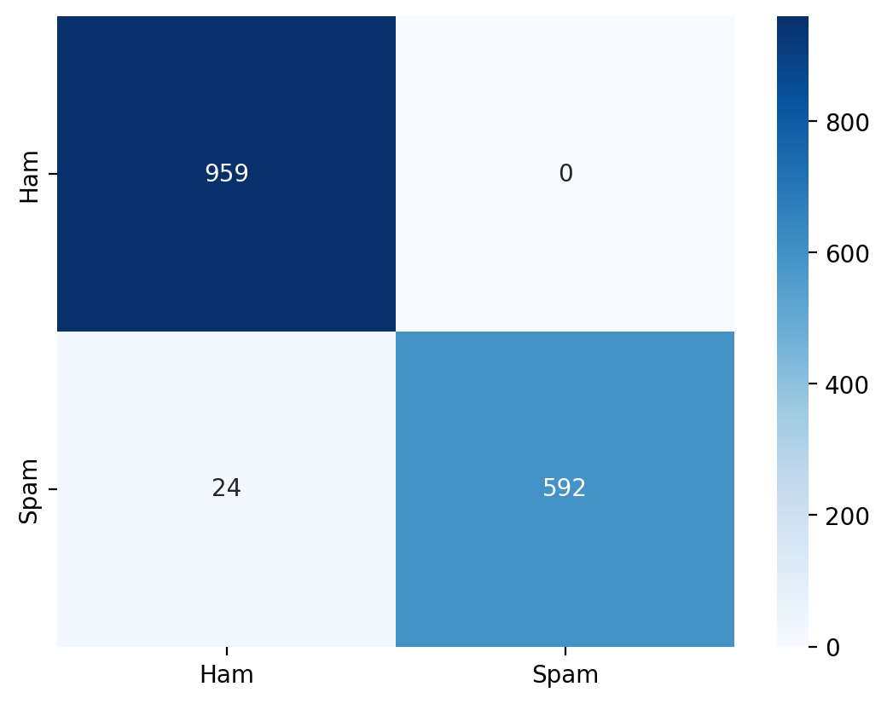
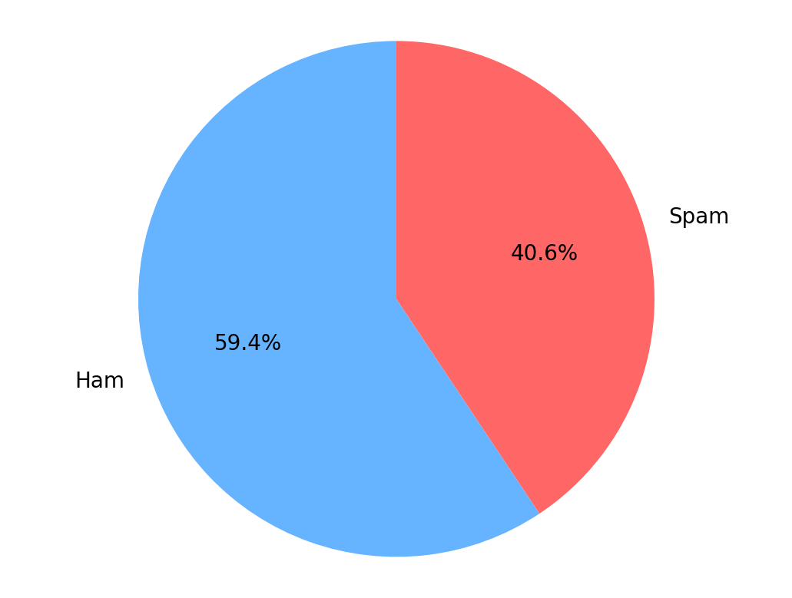

# 📧 Spam Email Detection System

An advanced Machine Learning application built with **Python** and **Streamlit** to detect spam emails using Natural Language Processing (NLP) techniques.

---

## 🚀 Overview

Spam emails pose a significant cybersecurity challenge. This project leverages the **Multinomial Naive Bayes** algorithm combined with **TF-IDF Vectorization** to classify emails as:

- **Spam**
- **Ham (Safe)**

The model achieves high accuracy through training on a large dataset of labeled messages.

---

## ✨ Features

- **Real-time Classification** – Instant results for any email text
- **Visual Analytics** – Confusion Matrix and Dataset Distribution charts
- **High Performance** – Optimized with Streamlit caching
- **User-Friendly Interface** – Clean, interactive web GUI
- **Easy Execution** – Windows `.bat` launcher included

---
## 📊 Model Performance & Results

The model achieved an impressive accuracy of **98.48%** on the test dataset. Below are the detailed metrics and visualizations.

### ✅ Key Metrics
- **Model Accuracy:** `98.48%` 🚀
- **Algorithm:** Multinomial Naive Bayes (Optimized with TF-IDF)

### 🧾 Classification Report
| Class       | Precision | Recall | F1-Score |
|-------------|:---------:|:------:|:--------:|
| **Ham** | 0.99      | 0.99   | 0.99     |
| **Spam** | 0.97      | 0.95   | 0.96     |
| **Overall** |           |        | **0.98** |

### 📈 Visualizations

| 📊 Confusion Matrix | 📉 Dataset Distribution |
|---------------------|-------------------------|
|  |  |
| *Shows the correct vs incorrect predictions* | *Shows the balance between Ham and Spam emails* |


---
## 🧪 Examples

**Spam (Phishing):**
```bash
Dear Valued Customer,

We’ve detected unusual activity on your Amazon account and temporarily suspended it for your protection.

To restore full access, please verify your identity here:
http://amazn-security-verify.example.com

Failure to verify within 24 hours will result in permanent account suspension.

Thank you for your prompt attention.

— Amazon Security Team

```

**Ham (Safe):**
```bash
Hi Team,

Hope you’re all doing well. Just a reminder that our weekly project sync is scheduled for Monday, May 19 at 10:00 AM CEST.

Agenda:
1. Progress updates
2. Roadblocks & support needed
3. Next steps & deadlines

Join via Zoom:
https://company.zoom.us/j/1234567890

Please add any additional agenda items by replying to this email by end of day Friday.

```
---

## 🛠️ Tech Stack

- Python 3.x
- Scikit-Learn, Pandas, NumPy
- Streamlit
- Matplotlib & Seaborn

---

## 📂 Project Structure

```
├── ML_spam_email.py
├── preprocessed_data.csv
├── requirements.txt
└── run_spam_app.bat
```

---

## 💻 Quick Start

```bash
git clone https://github.com/Mohamed-3M-Nouman/Spam-Email-Classifier.git
cd Spam-Email-Classifier
pip install -r requirements.txt
streamlit run ML_spam_email.py
```

---
    
## 👨‍💻 Author

**Mohamed Nouman** – AI & Computer Science Student, Assiut University
